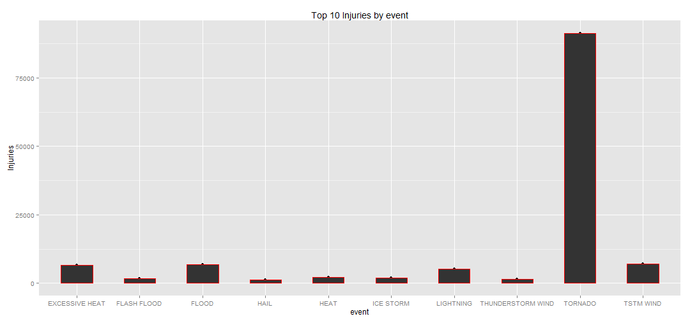

Exploring the U.S. National Oceanic and Atmospheric Administration's (NOAA) storm database
========================================================

Storms and other severe weather events can cause both public health and economic problems for communities and municipalities. Many severe events can result in fatalities, injuries, and property damage, and preventing such outcomes to the extent possible is a key concern.

This project involves exploring the U.S. National Oceanic and Atmospheric Administration's (NOAA) storm database. This database tracks characteristics of major storms and weather events in the United States, including when and where they occur, as well as estimates of any fatalities, injuries, and property damage.

The events in the database start in the year 1950 and end in November 2011. In the earlier years of the database there are generally fewer events recorded, most likely due to a lack of good records. More recent years should be considered more complete.

**Synopsis**

The below report done on the storm database aim to give an insight on the events that were most harmful with respect to population health in term of fatalities and injuries.
In addition to population health the report will also cover the consequences on the US economie caused by weather events.
This report is helpful for future preparation for severe weather events.

**Data Processing**

The analysis was conducted on the storm events database available for public [Storm Data](https://d396qusza40orc.cloudfront.net/repdata%2Fdata%2FStormData.csv.bz2)

The below R code describe the data processing part in the analysis; loading the data from the csv file, cleaning the data by adding some extra variables that will help during the analysis, generate KPIs by aggregating the data on the event level.


```
## Warning: package 'ggplot2' was built under R version 3.0.3
## Warning: package 'gridExtra' was built under R version 3.0.3
```

```
## Loading required package: grid
```


```r
## First start by reading the data
rawdata <- read.csv("repdata_data_StormData.csv")

## Create a function to transform the EXP (expression numbers) to figures
exp_transform <- function(e) {
  # h -> hundred, k -> thousand, m -> million, b -> billion
  if (e %in% c('h', 'H'))
    return(2)
  else if (e %in% c('k', 'K'))
    return(3)
  else if (e %in% c('m', 'M'))
    return(6)
  else if (e %in% c('b', 'B'))
    return(9)
  else if (!is.na(as.numeric(e))) # if a digit
    return(as.numeric(e))
  else if (e %in% c('', '-', '?', '+'))
    return(0)
  else {
    stop("Invalid exponent value.")
  }
}

## Add more variable to the raw data that transalates the exp numbers
prop_dmg_exp <- sapply(rawdata$PROPDMGEXP, FUN=exp_transform)
rawdata$prop_dmg <- rawdata$PROPDMG * (10 ** prop_dmg_exp)
crop_dmg_exp <- sapply(rawdata$CROPDMGEXP, FUN=exp_transform)
rawdata$crop_dmg <- rawdata$CROPDMG * (10 ** crop_dmg_exp)

## Total number of rows in the csv file
nrow(rawdata)
```

```
## [1] 902297
```

```r
## Aggregate the type of events that caused the highest number in fatalities and injuries.
## Fatalities
fatalitiesbyevtype <- aggregate(rawdata$FATALITIES, by=list(rawdata$EVTYPE), FUN=sum)

## Injuries
injuriesbyevtype <- aggregate(rawdata$INJURIES, by=list(rawdata$EVTYPE), FUN=sum)

## Get the top 10 fatalities/Injuries
## Fatalities
names(fatalitiesbyevtype) <- c("event","fatalities")
fatalitiesbyevtype <- fatalitiesbyevtype[rev(order(fatalitiesbyevtype$fatalities)),]
top10fatalities <- fatalitiesbyevtype[1:10,]

## Injuries
names(injuriesbyevtype) <- c("event","injury")
injuriesbyevtype <- injuriesbyevtype[rev(order(injuriesbyevtype$injury)),]
top10injuries <- injuriesbyevtype[1:10,]

## Get the top 10 events with the greatest economic consequences
economicbyevtype <- aggregate(list(rawdata$prop_dmg,rawdata$crop_dmg), by=list(rawdata$EVTYPE), FUN=sum)
names(economicbyevtype) <- c("event","propdmg","corpdmg")

## Prepare the top 10 events with the greatest proprery and corporate damage consequences
propertyconsbyevtype <- economicbyevtype[rev(order(economicbyevtype$propdmg)),c("event","propdmg")]
top10propconsequences <- propertyconsbyevtype[1:10,]

names(top10propconsequences) <- c("event","propdmg")

corpoconsbyevtype <- economicbyevtype[rev(order(economicbyevtype$propdmg)),c("event","corpdmg")]
top10corpconsequences <- corpoconsbyevtype[1:10,]

names(top10corpconsequences) <- c("event","corpdmg")
```

**Results**

```r
## Plot the Top 10 Fatalities by event
qplot(x=top10fatalities$event,y=top10fatalities$fatalities,data=top10fatalities, 
      xlab = "event", ylab="Fatalities", main="Top 10 Fatalities by event") + geom_bar(stat="identity", colour = "red", width = .5)
```

 

```r
## Plot the Top 10 Injuries by event
qplot(x=top10injuries$event,y=top10injuries$injury,data=top10injuries, 
      xlab = "event", ylab="Injuries", main="Top 10 Injuries by event") + geom_bar(stat="identity", colour = "red", width = .5)
```

 

```r
## Prepare the Top 10 events with the greatest prop and corp consequences
p1 <- ggplot(data=top10propconsequences, aes(x=reorder(top10propconsequences$event,top10propconsequences$propdmg), y= top10propconsequences$propdmg, fill = top10propconsequences$propdmg ) )
p1 <- p1 + geom_bar(stat="identity")
p1 <- p1 + coord_flip()
p1 <- p1 + labs(x=("Property damage expense"), y =("event") , title = ("top 10 events with the greatest property damage consequences"))
p1 <- p1 + theme(legend.position="none")

p2 <- ggplot(data=top10corpconsequences, aes(x=reorder(top10corpconsequences$event,top10corpconsequences$corpdmg), y= top10corpconsequences$corpdmg, fill = top10corpconsequences$corpdmg ) )
p2 <- p2 + geom_bar(stat="identity")
p2 <- p2 + coord_flip()
p2 <- p2 + labs(x=("Corporate damage expense"), y =("event") , title = ("top 10 events with the greatest Corporate damage consequences"))
p2 <- p2 + theme(legend.position="none")

## Plot the 2 charts in one single panel
grid.arrange(p1,p2)
```

 

